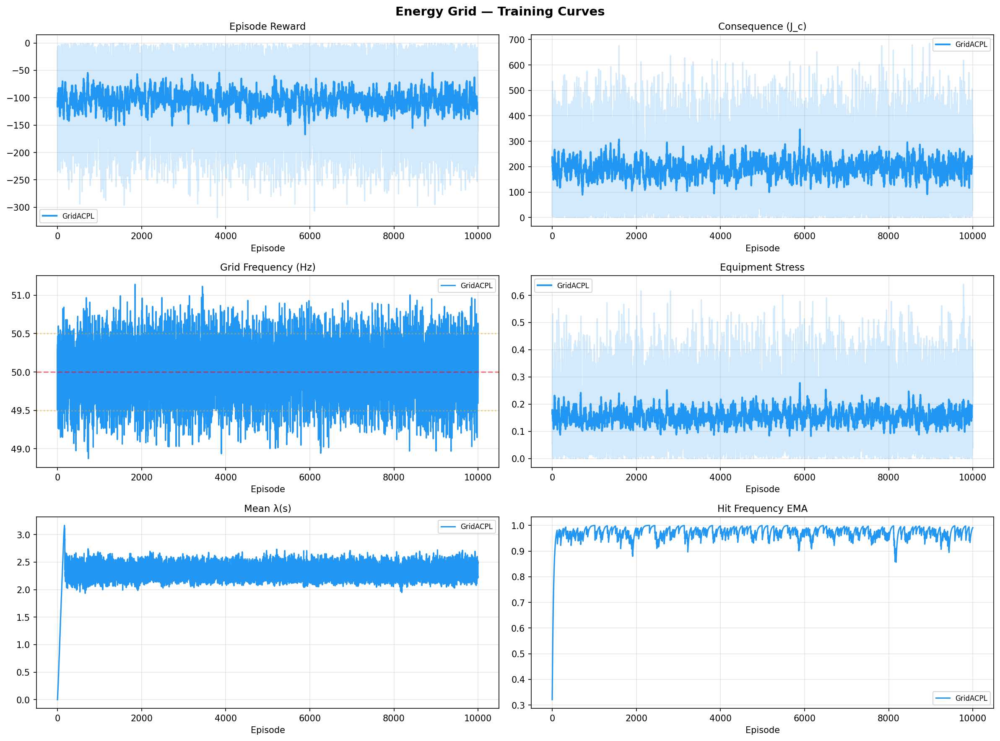
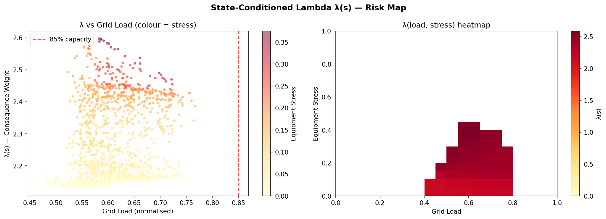
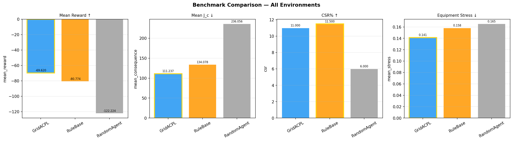

# GridACPL — Energy Grid Load Balancing Benchmark 

GridACPL is an energy grid benchmark built on Adaptive Consequence-Penalized Learning applied to power grid management. 
Designed to study consequence-aware reinforcement learning under delayed system stress, fluctuating demand, and operational constraints.

## Quick Start

```bash
cd energy_grid
python run.py --quick          # 100 episodes, fast test
python run.py --episodes 1000  # full training
python run.py --help           # all options
```

## Project Structure

```
energy_grid/
├── run.py                         ← ENTRY POINT
├── environments/
│   └── grid_env.py                ← Grid simulation (18-state, 5-action)
├── agents/
│   ├── grid_acpl_agent.py         ← GridACPL continuous agent
│   └── baselines.py               ← RuleBase, RandomAgent
├── networks/
│   └── grid_networks.py           ← GRU, Actor, Critic, Lambda, Delay nets
├── training/
│   ├── train_grid.py              ← Training loop, evaluation, logging
│   └── replay_buffer.py           ← Experience replay
├── evaluation/
│   └── plots.py                   ← Training curves, lambda heatmap, etc.
├── utils/
│   └── normalizer.py              ← Online state normalizer
├── logs/                          ← JSON training logs (auto-created)
└── results/                       ← Plots (auto-created)
```

## What ACPL Does Here

| Component        | Grid Role                                              |
|------------------|--------------------------------------------------------|
| GRU encoder      | Remembers 24h price/demand cycles                      |
| Consequence net  | Predicts stress (4h), efficiency (24h), billing (30d) |
| Lambda net       | Raises penalty near capacity limits & high stress      |
| Delay estimator  | Learns that stress signals arrive ~4h after overload   |
| Hit-freq EMA     | Tracks how often consequence thresholds are breached   |

## State Space (18-dim)
load_norm, renewable_fraction, spot_price, equipment_stress, reserve_margin,
frequency_deviation, gas/coal/nuclear/renewable outputs, battery_soc,
time encoding (sin/cos), temperature, cumulative_stress_24h, market_trend

## Action Space (5-dim continuous, each ∈ [-1, 1])
gas_delta, coal_delta, market_action, load_shed, battery_action

## Environments
- `energy_grid`  — standard (training)
- `grid_easy`    — reduced demand (training)
- `grid_hard`    — high demand (training + eval)
- `grid_storm`   — extreme renewable variability (unseen)
- `grid_peak`    — heatwave +25% demand (unseen)

## Sample Results

### Training Curves


### State Conditioned Lambda


### Benchmark Comparison

